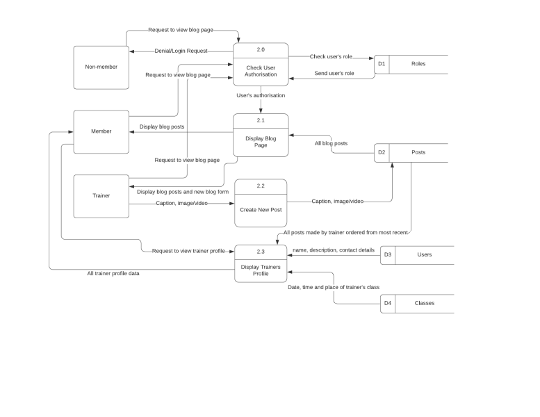
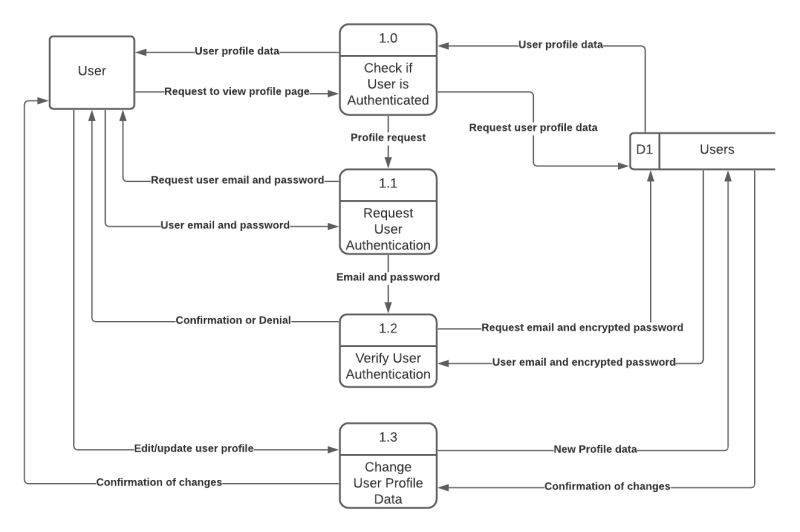
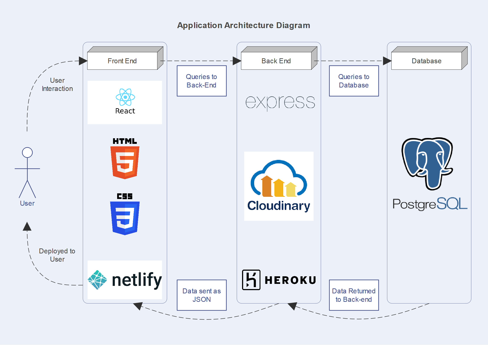
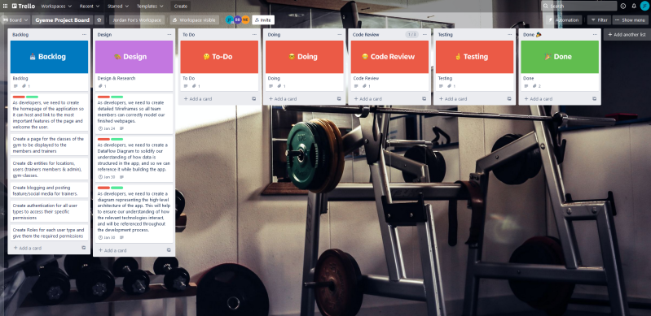
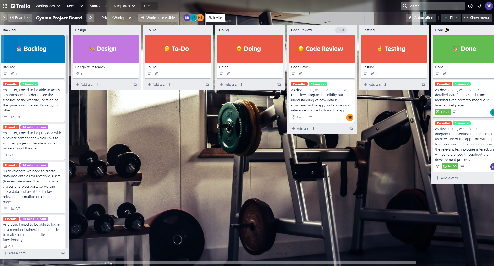

# Ben Bartholomew T3A2-A

## R1 - Website Description
Our application is for a Gyeme Fitness Clubs, which is a meme-themed gym, currently with three locations, and will facilitate trainers working at the gym to create and manage classes, and current members to get in touch with trainers, and to sign up for existing classes.

Purpose:
To provide a platform where trainers can easily view information related to their classes as well as create, update and delete classes. As well as a platform where members can view information related to the gym and the gym’s trainers, such as contact info and qualifications, sign up for new classes and view and manage the classes for which they have already signed up.

Features:
This application will have a number of MVP features which are essential to its primary functionality and will thus be prioritized, as well as optional features to further extend its
functionality which will be added if time permits.

Essential features:
1. User Authentication: members will need to be authenticated in order to access the functionality of the app related to gym members. And gym trainers who use the app will need similar authentication for their part.
2. Authorization: the members of the gym using the app will be given different roles and permissions to the non-members. The trainers/staff using the app will also need specific permissions not accessible by the other user types, such as adding classes.
3. Display: This app will need components and pages which display information about the gym itself, such as the locations and opening hours of the clubs and the trainers at the gym, such as their classes and availability, and these will differ across the three club locations. Members will need to be able to view their own information, such as the classes they have already signed up for.
4. Notifications: Trainers will receive notifications of when members have booked their classes and members will receive notifications when they have an upcoming class.

Possible extra features:
1. Internal user messaging: a member may send messages to a trainer, in regards to classes or other gym-related events.
2. Email notifications: trainers and members may be able to receive notifications from the app through their email regarding classes and other important events.
3. Email password verification: this app will be structured such that an account is created for a member after they have signed a physical contract at an actual club; this password may be changed by the member, by verifying their email address.
4. Blog posting for trainers: trainers can upload blog posts, pictures or videos or other such things to their profile for members to view. Other trainers or members may be able to
comment on these.
5. Progress logs: members may be able to keep track of their own progress by keeping a log or journal of their exercise history or fitness goals.

Target Audience:
The target audience of this application will be the client base of the gym it is used by, which will
be primarily young adults aged 18-50, who are familiar and comfortable using the internet, but
will also be accessible by anyone looking to improve their overall health and fitness through
exercise.

Tech Stack:
This application will be built with the PERN stack. It will use PosgreSQL as its database, Node.js
and Express.js for its backend operations, and React for its front end components.

## R2 - Dataflow Diagram

## R3 - Application Architecture Diagram

## R4/R6 - User Stories/Trello Screenshots
https://trello.com/b/83a5vZmT/gyeme-project-board
### 21/01:

### 27/01:

## R5 - Wireframes

